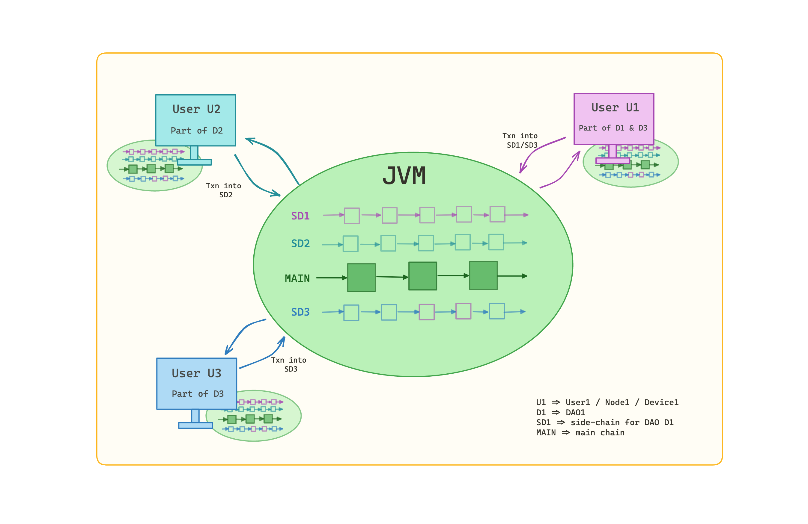

  <a href="https://nextjs.org">
    <picture>
      <source media="(prefers-color-scheme: dark)" srcset="assets/brand/logo-jsconic-horizontal.svg">
      
    </picture>
    <h1 align="center">Jsonic Whitepaper</h1>
  </a>

 <strong>
   A blockchain based system for validation and valuation of business transactions among Decentralized Autonomous Organizations.
 </strong>

 

   
  <!-- Discourse -->
  
  <!-- Twitter -->
  
   
   
    <!-- License -->
  

  <h3>
    <a href="https://discord.gg/IndiaTech">
      Community
    </a>
     | 
    <a href="https://jsonic.org">
      Website
    </a>
     | 
    <a href="https://jsonic.org/">
      Contribute
    </a>
  </h3>

 

## Abstract
_This paper presents an abstract of the Jsonic ecosystem, a blockchain platform designed to revolutionize business transactions in the Web3 era. It provides an overview of Jsonic's architecture, consensus mechanism, governance model, tokenomics, and incentives. The paper highlights the platform's interoperability with existing business systems, supported by its API and SDK. It also discusses ongoing research and development efforts, planned upgrades, and future features, such as e-invoicing, payment processing, project management, and more. Jsonic's long-term vision is to become the standard platform for businesses, with all transactions recorded on the blockchain and the Jsonic token reflecting the market cap of businesses. By fostering transparency, trust, and economic growth, Jsonic aims to redefine traditional GDP measurements and create a more inclusive global business landscape._

**Authors**: Original copyright protected work of [@protosphinx](https://twitter.com/protosphinx), Somesh Mishra, Brajesh, TK TK 2023-05-17

## Table of Contents

- [Section 1: Introduction](#section-1-introduction)
  - [1.1 Background and Motivation](#11-background-and-motivation)
- [Section 2: Jsonic Blockchain Architecture](#section-2-jsonic-blockchain-architecture)
  - [2.1 Overview of Jsonic Components](#21-overview-of-jsonic-components)
  - [2.2 Definitions and Abbreviations](#22-definitions-and-abbreviations)
  - [2.3 DAO](#23-dao)
  - [2.4 Side-chains](#24-side-chains)
  - [2.5 Side-chains for DAO Ledger, Balance Sheet and P/L](#25-side-chains-for-dao-ledger-balance-sheet-and-pl)
  - [2.6 Main-chain](#26-main-chain)
  - [2.7 Jsonic Proof of Transaction (POT) Mechanism](#27-jsonic-proof-of-transaction-pot-mechanism)
  - [2.8 Jsonic Virtual Machine (JVM)](#28-jsonic-virtual-machine-jvm)
- [Section 3: Jsonic Ecosystem Components and Proof of Transaction (POT) Validation](#section-3-jsonic-ecosystem-components-and-proof-of-transaction-pot-validation)
  - [3.1 Overview of Jsonic Ecosystem Components](#31-overview-of-jsonic-ecosystem-components)
  - [3.2 DAOs and Nodes](#32-daos-and-nodes)
  - [3.3 Side-chains](#33-side-chains)
  - [3.4 Side-chain block structure](#34-side-chain-block-structure)
  - [3.5 Main-Chain](#35-main-chain)
  - [3.6 Main-chain block structure](#36-main-chain-block-structure)
  - [3.7 Jsonic Virtual Machine (JVM)](#37-jsonic-virtual-machine-jvm)
  - [3.8 Smart Contracts in Jsonic](#38-smart-contracts-in-jsonic)
  - [3.9 Jsonic Developer Tools and Resources](#39-jsonic-developer-tools-and-resources)
- [Section 4: Tokenomics and Incentives in the Jsonic Ecosystem](#section-4-tokenomics-and-incentives-in-the-jsonic-ecosystem)
  - [4.1 Token Minting](#41-token-minting)
  - [4.2 DAO Valuation Method](#42-dao-valuation-method)
  - [4.3 Method for evaluating Relevance Score](#43-method-for-evaluating-relevance-score)
- [Section 5: Jsonic Ecosystem and Integration with Existing Business Systems](#section-5-jsonic-ecosystem-and-integration-with-existing-business-systems)
  - [5.1 Interoperability with Existing Infrastructure](#51-interoperability-with-existing-infrastructure)
  - [5.2 Jsonic API and SDK](#52-jsonic-api-and-sdk)
  - [5.3 Cross-Chain Communication and Interoperability](#53-cross-chain-communication-and-interoperability)
  - [5.4 Compliance and Regulatory Considerations](#54-compliance-and-regulatory-considerations)
- [Section 6: Future Developments and Roadmap for the Jsonic Ecosystem](#section-6-future-developments-and-roadmap-for-the-jsonic-ecosystem)
  - [6.1 Ongoing Research and Development](#61-ongoing-research-and-development)
    - [6.1.1 eInvoicing and Payment Processing](#611-einvoicing-and-payment-processing)
    - [6.1.2 Project Management and Billing](#612-project-management-and-billing)
    - [6.1.3 Timesheets and Payroll](#613-timesheets-and-payroll)
  - [6.2 Planned Upgrades and Features](#62-planned-upgrades-and-features)
  - [6.3 Community Engagement and Ecosystem Growth](#63-community-engagement-and-ecosystem-growth)
  - [6.4 Long-term Vision](#64-long-term-vision)

## Section 1: Introduction

### 1.1 Background and Motivation

Jsonic is a B2B Blockchain protocol for achieving financial inclusion amongst businesses. The aim is to bring real world transactions on a blockchain through a mechanism of rewards, and to setup a transparent b2b protocol for transactions and contracts. Current traditional systems have inefficiencies, high costs, and security vulnerabilities, hindering seamless and efficient business-to-business (B2B) transactions. As businesses become more interconnected, there is a growing need for a scalable platform that can handle complex B2B transactions.

Blockchain technology is a promising solution to overcome these challenges. Platforms like Ethereum have showcased the potential of smart contracts and decentralized applications, extending the capabilities of blockchain beyond cryptocurrencies. However, high transaction costs and scalability issues, coupled with consensus mechanisms like Proof-of-Work (PoW) and Proof-of-Stake (PoS), have limited their widespread adoption. PoW's resource-intensive nature, along with PoS's potential for centralization, contradict the core principles of blockchain.

To address these challenges, Jsonic introduces a novel solution. Jsonic pioneers the Proof of Transaction (POT) mechanism, which is specifically designed for B2B use cases. This approach enables efficient recording of business transactions and incentivizes their on-chain validation, promoting broader adoption.

Jsonic is built around Decentralized Autonomous Organizations (DAOs), each with its own side-chain. These side-chains serve as individual balance sheets, ensuring efficient transaction processing and scalability while keeping the main-chain unburdened. Also playing a critical role here are a Proprietary method for DAO valuation[See _DAO Valuation Method_](#42-dao-valuation-method) and rank evaluation for DAOs[See _Method for evaluating Relevance Score_](#43-method-for-evaluating-relevance-score)

Jsonic's ecosystem is built on the Jsonic Virtual Machine (JVM) which will in the future also support the deployment of versatile smart contracts for a wide range of applications and use cases, including business-to-business transactions, supply chain management, financial services, and digital identity management.

## Section 2: Jsonic Blockchain Architecture

### 2.1 Overview of Jsonic Components

Jsonic is designed to deliver a scalable, efficient, and secure solution for various business applications. Its innovative structure consists of a main-chain and multiple side-chains. On Jsonic, businesses assume pseudonymous identity and record their business transactions on-chain within the network. Pseudonymous identity allows companies to make their business activities public without disclosing their real identity. This serves as a mechanism to publicly validate business transactions in a pseudonymous manner. This allows a company to gain benefits in ways similar to public listing on a stock exchange.

### 2.2 Definitions and Abbreviations

 + **IRL**: IRL (in real life) is an abbreviation used to explain when a person is speaking about something real and outside the digital world of communication, gaming or virtual reality.

 + **JVM**: JVM, which stands for Jsonic Virtual Machine, is an active instance of the Jsonic application running on each user device. The JVM acts as a virtual environment where smart contracts are executed, data is processed, and calculations take place.

 + **Node**: A node refers to an electronic device that is connected to the Jsonic network and runs the JVM. This can include devices such as mobile phones, tablets, computers, or any hardware capable of connecting to the internet and running the JVM.

 + **DAO**: DAO, short for Decentralized Autonomous Organization, represents a business entity within the Jsonic network. A DAO consists of a group of nodes that serve the business and maintain its on-chain data.

 + **User**: A user is an individual who is a member of the Jsonic network. To be a user, one must be a member of at least one DAO, although it is possible to be part of multiple DAOs.

 + **Transaction**: A transaction refers to a business transaction among one or more DAOs involving one of the supported transaction types, which currently include invoices and payments.

 + **Heartbeat**: A fixed time interval at which each JVM instance, i.e. each node, confirms its liveness to the network.

 + **Solstice**: Solstice serves as an analogy to the end of an IRL financial year. A Solstice occurs at a Solstice interval that is an integer multiple of the Heartbeat. Solstice is the point in time when a block is added to the main-chain.

 + **Materiality**: Materiality represents a percentage of the total value of existing transactions on a side-chain. When a set of new transactions exceeds this Materiality threshold in terms of value, a block is added to the side-chain.

 + **POT**: The Proof of Transaction, in short POT, mechanism checks whether a transaction recorded on-chain by a DAO is well-formed and complete.

 + **Adrenaline**: Adrenaline serves as a measure of the speed of the heartbeat. With a higher number of participants, there is an increase in incoming transactions per Heartbeat. Consequently, a larger volume of transactions necessitates a dose of Adrenaline (an increment in value), leading to a reduction in the value of the Heartbeat interval. This adjustment ensures that the number of transactions processed per Heartbeat remains consistent.

 + **Anxiety**: Anxiety represents the proportion of invalid or incomplete transactions recorded by the DAOs on their chains. The Anxiety value lies within the open interval (0,1), where a lower value indicates a healthier state of the ecosystem. For instance, if DAO1 logs a transaction with DAO2, but DAO2 does not recognize the transaction, it contributes to an increase in improper transactions within a Heartbeat, subsequently raising the Anxiety level. Looking at it differently, a high Anxiety value is an indicator of low relevance transactions into the system.

### 2.3 DAO

DAO is standard for decentralized autonomous organization. In the Jsonic world, a DAO is the counterpart of a IRL business. A business becomes a DAO by signing up on the network. Individuals are not allowed to become DAO. The Jsonic network is an on-chain reflection of the world of businesses, and a DAO is an on-chain equivalent of a IRL business.

A DAO records B2B transactions with other DAOs on-chain. A dedicated blockchain based ledger is maintained for each DAO, aka a side-chain of the DAO. The transactions logged by the DAO into the network are recorded on the side-chain, and are put on the main-chain at Solstice.

### 2.4 Side-chains

Side-chains are responsible for processing and validating transactions and smart contracts related specifically to their respective DAOs. This distributed approach enables each DAO to maintain a decentralized and secure ledger of its transactions while simultaneously reducing the computational load on the main-chain.

A side-chain is an on-chain representation of a business’ Balance Sheet. Additionally, the side-chain contains all contracts like AOA, Shareholder’s register, Ledger etc. The Jsonic platform replicates the role of Journal Entries through invoicing.

As far as other aspects of a business such as payroll, inventory, supply chain etc; are concerned, for simplicity the platform has only taken invoicing currently but DAOs are free to put any type of and any amount of company data on-chain. Unsupported transactions are stored on-chain but not considered during incentivization of the DAOs.

At each Solstice, a side-chain transfers the on-chain data, in a meaningful and useful compact structure, to the main-chain just like a business does at the end of a financial year to close their account balances.

In exchange of the data transferred by a side-chain to the main-chain, the main-chain issues some amount of token to the side-chain i.e. to the owner DAO as reward. New tokens are minted to issue to the DAOs at Solstice during data sync from side-chain to the main-chain. The DAO valuation method (explained in section 4.2) is used to decide the amount of the token to be issued to each DAO.

A DAO keeps recording new transactions into the system at any point of time. Incoming transactions are accumulated until the combined value of the transactions reach a certain value, which is determined using Materiality. The Jsonic system weighs the value of new transactions against the total value of existing transactions on the side-chain of the DAO. To weigh the value of incoming transactions, the value of new transactions is compared with the materiality indicator Materiality. A new block is generated on the side-chain when the combined value of a set of transactions reaches the value of Materiality, and the transactions are added into the block.

A block takes as input, the output balances from the previous block, adjusts the balances according to new transactions, and produces the updated set of balances as output. This output becomes the input for the next block. Thus a chain of balances gets generated block by block on the side-chain, which serves as the ledger/proof of the history of balances.

In the architecture diagram above, the Jsonic main-chain is depicted in the middle, connecting to individual DAO side-chains above and below. This visual representation highlights the hierarchical structure of the Jsonic blockchain, with the main-chain acting as the central point for data exchange and aggregation among DAO side-chains.

### 2.5 Side-chains for DAO Ledger, Balance Sheet and P/L

Side-chains play a crucial role in the Jsonic blockchain architecture by providing dedicated and isolated environments for each DAO to maintain their balance sheets and conduct transactions. These side-chains operate independently, enabling each DAO to manage its financial records and execute smart contracts without impacting the performance of the main-chain. The side-chain structure ensures scalability and prevents network congestion caused by the increasing number of transactions and smart contracts among DAOs.

To ensure consistency and accuracy within the Jsonic ecosystem, the main-chain periodically synchronizes with individual side-chains at Solstice. This synchronization process involves aggregating the latest balance data from each side-chain and updating the global snapshot of the main-chain accordingly. By doing so, the main-chain provides a transparent and verifiable financial overview of the entire Jsonic ecosystem, while preserving the efficiency and high-throughput capabilities of the main-chain.

In addition to their role in maintaining balance sheets and conducting transactions, side-chains also facilitate cross-DAO transactions. This functionality allows for seamless and secure interactions between different DAOs, promoting collaboration and interoperability within the Jsonic network. The isolated nature of side-chains ensures that the transactions and smart contracts executed within a specific DAO remain independent, while still benefiting from the broader ecosystem's security and infrastructure.

Overall, the integration of side-chains into the Jsonic blockchain architecture enhances scalability, preserves performance, and enables seamless cross-DAO transactions, creating a robust and efficient platform for decentralized business operations.

### 2.6 Main-chain

The main-chain is the Jsonic blockchain, connecting individual DAO side-chains. It’s responsible for aggregating and reconciling balances of individual DAO side-chains. It provides a global snapshot of the Jsonic ecosystem's financial state at predetermined time intervals (definition of Solstice in section 2.1.1). This periodic consolidation of data ensures that the main-chain remains efficient, lightweight, and capable of handling high transaction throughput.

At every Solstice, the opening and closing balances, SOA and Transactions of all side-chains are collected and put under a new block on the main-chain. This is analogous to closing the balance sheet of a business at the end of a financial year.

In order to facilitate efficient data propagation across the network, Jsonic employs a sharding technique similar to Ethereum's approach. This allows for parallel processing of transactions and smart contracts, significantly improving the network's overall performance and scalability. Moreover, Jsonic's main-chain incorporates a parallel smart contract execution model, enabling simultaneous execution of multiple smart contracts without causing bottlenecks. This is crucial in ensuring that the system can handle the demands of a growing ecosystem of interconnected DAOs and their transactions.

### 2.7 Jsonic Proof of Transaction (POT) Mechanism

Jsonic's POT mechanism is inspired by real-world financial auditing practices and is designed to efficiently validate business transactions. The POT mechanism ensures the accuracy and security of these transactions by employing methods such as matching among participating DAOs, monitoring of sequential transaction IDs, and verification of digital signatures.

Let’s consider an example of an invoice sent by DAO1 to DAO2. This transaction is deemed complete if payment is made by DAO2 against the invoice. The system records this transaction on the side-chain of both the DAOs and checks the transaction in accordance with the applicable smart contract. This is classified as a matched transaction where both parties (DAO1 and DAO2) agree to the transaction.

Jsonic allows unmatched transactions too, between DAO1 and DAO2. Any unmatched transaction is put on the side-chain of DAO1 too, without it appearing on the side-chain of DAO2. However the Jsonic’s DAO valuation method (explained in section 4.2) won’t consider the unmatched transactions.

### 2.8 Jsonic Virtual Machine (JVM)

The Jsonic Virtual Machine (JVM) serves as the distributed computing infrastructure powering the Jsonic ecosystem. It is a virtual machine that executes & verifies contracts and transactions on behalf of DAOs. It functions as an instance of Jsonic running on each device connected to the network, and serves as the sole means of interacting with the Jsonic ecosystem. To effect changes within the network, every node must install and run the JVM. DAOs provide instructions to the JVM in the form of commands or smart contracts, which it validates and executes to make on-chain modifications.

Additionally, the JVM handles the broadcasting and subscribing to distributed changes across the network. Whenever a node makes a change on its DAO's side-chain, the JVM on that node broadcasts the change to all nodes that are members of the DAO (i.e., members of the same company). This ensures that all nodes can receive the new changes and remain synchronized with each other. Typically, there are two DAOs involved in a transaction, and the JVM broadcasts the transaction event to the members of the second DAO as well.

In the event of a change occurring on the main-chain, the acting node notifies the JVM running on all nodes, prompting them to synchronize with the latest state of the main-chain.

The JVM enables the execution of smart contracts and the verification of transactions across the network. Through the use of the Global Heartbeat mechanism, the JVM optimizes resource usage and reduces computational overhead, ensuring efficient operation of decentralized applications and services.

In summary, Jsonic's blockchain architecture has been designed to provide a scalable, efficient, and secure platform for various business applications. Its innovative structure, which encompasses a main-chain and multiple side-chains, along with the POT mechanism and the JVM, ensures that the Jsonic ecosystem can meet the demands of the Web3 era while overcoming the limitations of traditional blockchain systems.

## Section 3: Jsonic Ecosystem Components and Proof of Transaction (POT) Validation

The diagram illustrates the Jsonic ecosystem, featuring various components. At the center of the diagram is the Jsonic Virtual Machine (JVM), also known as the Jsonic Network. This network comprises three DAOs: D1, D2, and D3. Each DAO is associated with a corresponding side-chain, which is responsible for recording transactions and maintaining the balance sheet specific to that DAO. Alongside the side-chains, there is a main-chain that periodically captures snapshots of the balance sheets from all three side-chains.

Within the network, there are three users, represented by computer devices. User U1 is a member of D1 and D3, U2 belongs to D2, and U3 is part of D3. All users in the network remain synchronized with both the side-chains and the main-chain. However, each user can only add transactions to the side-chains associated with their respective DAOs. For instance, U1 can log a transaction executed by either D1 or D3. If U1 logs a transaction between D1 and another DAO, let's say Dn, the transaction will be recorded on the side-chain SD3 in the subsequent block, and the balance sheet of D3 will be updated accordingly. When the next block is added to the main-chain, the updated balance sheet will be captured.

In summary, the diagram showcases the Jsonic ecosystem's components. It demonstrates the relationship between the Jsonic Virtual Machine (JVM), the main-chain, side-chains, and the DAOs. Users are assigned to specific DAOs and can only add transactions to their associated side-chains. This architecture ensures synchronization across the network, maintaining accurate and up-to-date balance sheets for each DAO.

### 3.1 Overview of Jsonic Ecosystem Components

The Jsonic ecosystem consists of several key components, including the main-chain, side-chains and the Jsonic Virtual Machine (JVM). These components work together to create a scalable, efficient, and secure platform for various business applications.

### 3.2 DAOs and Nodes

A DAO is a business entity that is part of the Jsonic network. Every electronic user device connected with the Jsonic network is a node, and can be part of one or more DAOs. Multiple nodes may be part of a single DAO and record data on-chain for the DAO. Thus there’s a many-to-many relationship between DAO and node.

### 3.3 Side-chains

Side-chains are owned by DAOs and each DAO has its own side-chain. A DAO logs its business transactions on its side-chain. A transaction may come on the side-chain from a smart contract’s execution as well. A block is created on the side-chain when the value of the new transactions exceeds a threshold determined by the materiality parameter set by the network. Materiality for a side-chain depends on the number of transactions recorded by the owner DAO previously.

Transactions under each block of side-chain are converted into a Merkle tree and the Merkle root is kept on-chain under the block header. The balance sheet of the DAO is also maintained on each block. The balance sheet for the current block is calculated by making adjustments in the previous block’s balances, based on the transactions in the current block. The balance sheet’s state is also hashed and the hash is kept on-chain under block header.

### 3.4 Side-chain block structure

Following information is part a side-chain block:

* **Block Header**

  * Slot: The slot number in the side-chain where the block is included. It’s calculated by combining the previous slot number and the number of Heartbeats since the previous block was added.

  * Parent Slot: The slot number of the previous block.

  * Block Height: The height of the block in the blockchain i.e. the position of the block within the sequence of blocks. Height is 0 for genesys block, and gets incremented by 1 for each subsequent block.

  * State Root Hash: The Merkle root hash of the side-chain state i.e. Balance Sheet, after processing all the transactions in the block.

  * Transaction Root Hash: The Merkle root hash of the transactions included in the block.

  * Timestamp: The timestamp indicating when the block was created.

  * Block Hash: The hash of the block header.

  * Previous Block Hash: The hash of the previous block's header.

  * Block Signature: The cryptographic signature of the block, produced by the block producer DAO who created the block. It helps ensure the authenticity and integrity of the block.

* **Transactions**

  * List of Transactions: The actual transactions included in the block. Each transaction represents an action, operation, or smart contract interactions on-chain.

* **State**

  * Balance Sheet: The balance sheet of the DAO as the time of block creation. The current state of the balance sheet is calculated from the previous balance sheet  after adjusting the balances as per the transactions made side last block.

### 3.5 Main-Chain

The main-chain adds a new block at the fixed Solstice interval. Solstice interval value is a function of Heartbeat and Adrenaline. For example, when there are a low number of DAOs, there’d be a low number of transactions logged per heartbeat. In such a case of low throughput, the Solstice interval can be a large value such as a fiscal year quarter. However as the number of DAOs increase, so does the number of transactions logged per heartbeat. Therefore it’s sensible to make the Solstice interval lower and add blocks more often so that the snapshot is captured frequently. This would result in a low number of transactions captured in each snapshot, thus there'd be an extensive history of side-chain states available on the main-chain.

At the time of Solstice, hashes of the latest block from all side-chains are converted into another Merkle tree and the Merkle root is calculated. The root of this new Merkle tree is the combination of all transactions within a Solstice period. This single hash becomes the fingerprint of the states of all side-chains at every Solstice. The hash of this Merkle root is put under the header of the main-chain block that gets added.

Additionally, at Solstice, the transactions recorded by a DAO (let's say D) are converted into a weighted graph where vertices would be the DAO D and all DAOs with whom the DAO transacted since last Solstice. The weight of each transaction is determined with the transaction Relevance Score calculation method (explained in 4.3). If the DAO transaction with another DAO D1 and the total value of the transactions among them is X1, then the weight of the edge between D and D1 would be X1. The graph is stored on an IPFS and shared among all nodes in the network. Being on an IPFS, the distributed graph can be read by any node in the network and the JVM running at the node can run the DAO valuation method (explained in section 4.2) with the graph. This way any random node can be chosen to run the DAO valuation method and to evaluate the total amount of token to be minted, and the amount of token to be rewarded to each DAO. Information of the newly minted token is stored under the main-chain block to keep history of the token minting.

### 3.6 Main-chain block structure

Following information is part a main-chain block:

* **Block Header**

  * Slot: The slot number in the blockchain where the block is included. It’s calculated by combining the previous slot number and the number of Heartbeats since the previous block was added.

  * Parent Slot: The slot number of the previous block.

  * Block Height: The height of the block in the blockchain i.e. the position of the block within the sequence of blocks. Height is 0 for genesys block, and gets incremented by 1 for each subsequent block.

  * Record Root Hash: The Merkle root hash of the records included in the block.

  * Timestamp: The timestamp indicating when the block was created.

  * Block Hash: The hash of the block header.

  * Previous Block Hash: The hash of the previous block's header.

  * Block Signature: The cryptographic signature of the block, produced by the block producer or validator who created the block. It helps ensure the authenticity and integrity of the block.

* **Records**

  * Records: Each record is either the hash of a side-chain’s latest block at the time of block creation, or a result of smart contract interactions.

* **Rewards**

  * Validator Rewards: The rewards earned by the validators for participating in block production and consensus.

  * DAO Rewards: The rewards earned by the DAOs for contributing to the network by logging their business transactions.

### 3.7 Jsonic Virtual Machine (JVM)

The Jsonic Virtual Machine (JVM) functions as the distributed computing infrastructure that empowers the Jsonic ecosystem. It enables the verification of transactions and the execution of smart contracts across the network. Running on each node, which refers to a user device, the JVM serves as the gateway for interacting with the Jsonic network. Collaborating with the global heartbeat mechanism, the JVM optimizes resource usage and reduces computational overhead, ensuring the efficient operation of decentralized applications and services. To maintain connectivity with the network, each node must keep the JVM running continuously, as it requires publishing a liveness event at regular Heartbeat intervals.

When a node intends to interact with its side-chain or the main-chain, it communicates instructions to the JVM via manual input or an existing smart contract. The JVM validates these instructions against the current network state and executes them to modify the state of the respective side-chain or main-chain. The resulting modifications are broadcasted by the JVM to allow other nodes running the JVM to listen and verify the changes. Once a certain percentage of recipient nodes confirm the changes, they are added to the respective chain.

The JVM also facilitates the onboarding process for new nodes. A new node can join an existing node or create a new Decentralized Autonomous Organization (DAO). Members of a DAO can invite new members by sharing an invitation link. When the invitee clicks the link, the JVM is installed on their device if not already running. The JVM then collects the invitee's profile information, generates a unique ID for the node, and adds it to the DAO. All nodes within the DAO are notified of the new member's presence. Alternatively, individuals can directly download and install the JVM on their devices, and set up their own DAO by providing relevant business information. In this case, the JVM registers a new DAO, establishes a side-chain, adds a genesis block, and broadcasts an event across the network to notify other DAOs about the newly created DAO.

When a user records a new transaction on the network, the JVM running on their device validates the transaction using POT. If the transaction is deemed valid, it is stored in the shared storage (IPFS) of the respective DAO. All transactions within a DAO are stored within this shared storage, accessible to all nodes within the DAO. Due to the presence of signatures on the data, transactions are not viewable by entities outside the DAO. This arrangement ensures that all new transactions, as well as existing on-chain transactions, are visible to each node within the DAO. Nodes within the DAO can raise disputes against recorded transactions. If a majority of nodes dispute a transaction, it is marked as invalid and discarded by the network.

As explained in section 3.2, not every transaction is immediately added to a side-chain block. A block is created on the side-chain only when the weight of new transactions exceeds the Materiality threshold. During the storage of a transaction in the shared storage, the JVM calculates the combined weight by considering the weight of all transactions recorded since the last block creation. If the combined weight exceeds the current Materiality value for the DAO, the JVM of the respective node constructs a block and publishes it to the side-chain. This block is then disseminated to all nodes within the DAO.

During Solstice, the JVM places the latest block from each side-chain into the shared storage (IPFS). Consequently, all nodes on the network gain access to the information within the latest blocks of all side-chains. A random node is elected, based on staked token weightage, to prepare and publish the main-chain block. The elected node's JVM retrieves the side-chain block from the shared storage, runs the DAO valuation method (explained in section 4.2), evaluates the token reward for each DAO, and includes the token distribution data in the block. The node proceeds to create the main-chain block and publishes it across the network. Other nodes in the network verify the main-chain block, and upon receiving approval from the majority of members, the block is added to the main-chain. At this point, the specified amount of tokens is minted and issued to the DAOs.

In conclusion, the components of the Jsonic ecosystem, including nodes, side-chains, the main-chain, and the JVM, collaborate to establish a secure and efficient platform for various business applications. The application of POT validation methods ensures the accuracy of business transactions within the Jsonic ecosystem, solidifying Jsonic's position as a scalable and adaptable solution in the Web3 era.

### 3.8 Smart Contracts in Jsonic

Jsonic's smart contracts are designed to mimic real-world business transactions, such as invoicing, project management, and payroll processing. The Jsonic platform provides a robust and secure environment for deploying and executing smart contracts, ensuring transaction integrity, anonymity, and verification.

Smart contracts are self-executing agreements with predefined terms and conditions that are implemented on blockchain networks. They are essentially lines of code that automatically execute certain actions or transactions when specific conditions are met. Smart contracts function based on the principle of if-then statements. They contain predefined rules and conditions that specify how the contract will operate. When the specified conditions are met, the contract is automatically executed, and the agreed-upon actions or transactions are carried out.

In the Jsonic network, a smart contract is deployed and stored on the side-chain of the creator DAO. The contract's code, rules, and logic are publicly visible and transparent to all participants in the network. This transparency ensures that the execution of the contract is tamper-proof and cannot be altered by any single entity.

By utilizing smart contracts, the invoicing process becomes more efficient and transparent. Smart contracts can automate the verification of payment status, eliminate the need for manual tracking and reconciliation, and provide a secure and auditable record of the transaction.

### 3.9 Jsonic Developer Tools and Resources

To support the development and deployment of smart contracts, Jsonic offers a comprehensive suite of developer tools and resources. These tools enable developers to build, test, and deploy smart contracts within the Jsonic ecosystem, facilitating the seamless integration of blockchain-based solutions into business operations.

In this section, we have explored the Jsonic Virtual Machine, the role of smart contracts in the Jsonic ecosystem, and the various use cases for Jsonic's smart contracts. By providing a robust and efficient platform for executing smart contracts, Jsonic aims to revolutionize the way businesses conduct transactions in the Web3 era.

## Section 4: Tokenomics and Incentives in the Jsonic Ecosystem

### 4.1. Token Minting
Token minting in the Jsonic ecosystem occurs at Solstice upon successful creation of a main-chain block. The amount and value of tokens to mint and assign, is determined with the DAO valuation method (explained in section 4.2) which is similar to the PageRank method in terms of the use of Spectral Graph Theory applied to B2B transactions. This token minting process ensures that the creation of new tokens is tied directly to the economic activity within the Jsonic ecosystem, promoting a stable and sustainable token supply.

### 4.2 DAO Valuation Method
DAO valuation method is based on the proprietary DAO business ranking method. The method analyzes the links created via transactions, among DAOs, and assigns a rank value to each DAO in the network. The rank value assigned to each DAO becomes one of the factors to determine the amount of tokens to issue to the DAO at Solstice, because it makes sense to reward a DAO having higher reputation within the network.

Present approach to determine business ranks of DAOs looks at the structure of interconnectivity amongst members in the Jsonic network. The structure of interconnectivity can be stored on a database in the form of a matrix, where element $[i, j]$, i.e. element in ith row and jth column of the matrix, in the matrix indicates the presence of a connection between DAO $j$ and DAO $i$.

An example of a connectivity matrix used to describe the interconnectivity among DAOs in the Jsonic network is as follows. For illustrative purposes, suppose the universe of the Jsonic network consists of only five DAOs namely D1, D2, D3, D4, and D5. Following are the linkages among the DAOs, where a linkage between two DAOs means there’s at least one transaction recorded between the two DAOs.

D1 has a linkage to D2, D3, and D4.

D2 has a linkage to D1 and D4.

D3 has a linkage D1, D4, and D5.

D4 has a linkage to D1, D2, D3, and D5.

D5 has a linkage to D3 and D4.

In the example, this interconnectivity is described by the matrix M:

$$\begin{bmatrix}
    0&1&1&1&0\\
    1&0&0&1&0\\
    1&0&0&1&1\\
    1&1&1&0&1\\
    0&0&1&1&0\\
    \end{bmatrix}$$

Thus, the Jsonic network can be represented by a graph G, where each node of graph G corresponds to a member of the network. If DAO-1 and DAO-2, who are members of the network, are linked to each other, there is an arc between nodes representing DAO-1 and DAO-2 respectively. On the other hand, if two DAOs are not linked to each other, then there is no arc between nodes representing them. In the inter-connectivity matrix M, also known as Adjacency matrix of graph G, element $[i, j]$ is denoted by $M_ij$. $M_ij$ is equal to 1 if there is an arc between node $i$ and node $j$, otherwise $M_ij$ is equal to 0.

When we divide all the elements of $i$th row; the matrix M by sum of elements in the $i$th row, we get a normalized Adjacency matrix P. Thus, sum of all elements of each row of matrix P equals 1. For graph inherited from the network illustrated by Figure 3 the normalized Adjacency matrix P is

$$\begin{bmatrix}
    0& 1/3 & 1/3 & 1/3 &0\\
     1/3 &0&0& 1/3 &0\\
     1/3 &0&0& 1/3 & 1/3 \\
     1/3 & 1/3 & 1/3 &0& 1/3 \\
    0&0& 1/3 & 1/3 &0\\
    \end{bmatrix}$$

In the following a method to predict the business ranks of a given DAO X, using information gathered from the linkage structure of the network graph G, and the profile information of other DAOs in X’s network is described.

The process can be understood as rank vector propagation through the graph G. The rank vector of a node is calculated using the rank vectors of the neighboring nodes, which in turn are calculated using the rank vectors of their neighbors. The following provides a mathematical realization of the procedure equivalent to the explanation described above, but provides a more direct and concise characterization of the procedure.

For each node $j$, we define a rank vector $x^j$ consisting of probabilities ($x^j_1$, $x^j_2$, $x^j_3$,…, $x^j_n$) where summation over the subscript yields 1. Since the value of a component of a rank vector $x^1$, of a particular node, say node 1, depends upon its neighbor in the graph, say node 2, we define another score associated with all the nodes which determines how much they contribute to their neighboring nodes. This score is associated with the node $j$ is called the contribution statistic $x^j$. This statistic represents a measure of how much a particular neighbor of node $j$ contributes to the value of each $x_k^j$. We define $x_k^j$ as the weighted average of all $x^i_k$ of neighboring nodes $i$.

Hence,

$$x^j_k = \sum_{i{\varepsilon}NBD(j)}\frac{x^j_k}{|Nbd(j)|}\tag*{...(1)}$$

$Nbd(X)$ is a set of DAOs that are linked to DAO $X$ in the network. In terms of graph theory, $Nbd(X)$ is a collection of nodes, each of which has an arc connecting to node $X$. $|Nbd(X)|$ is the number of arcs going out from the node $X$ i.e. number of elements in the set $Nbd(X)$. Thus, $|Nbd(X)|$ corresponds to the degree of the group $X$ and may also be written as $deg(X)$.

The _contribution statistic_ $y^i_k$ of the node $i$ depends recursively on the rank vector components $x^i_k$ of all its neighbors. The contribution statistic seeks to normalize the probability distribution and match it to a preset value $P$.

The method predicts the probability of a node having a particular rank value that is not known for the DAO represented by the node. The desired probability is represented by $x^u_j$ for node $j$. The method takes into account the nodes for which the particular rank value is provided by the DAO represented by the node, by assigning a probability score of 1 or 0 to $x_i$ for nodes $i$ with known rank values depending upon whether that rank value is possessed or not. For such nodes the probability is denoted by $x^k_i$.

For a given rank value, if the probability scores for all the nodes in the network are combined, we get a vector $x_i$. It can be seen that:

$$x_i = x^u_i + x^k_i$$

Therefore, from the above equation (1):

$$x_i^u = \frac{1}{deg(i)} \sum_{j\epsilon{Nbd}(i)}^{}y_{j}$$

$$x_i^u = \sum_{j=1}^{n}M_{ij}.y_{j}$$

In Vector form, this is equivalent to

$$x^u = My \tag*{...(2)}$$

The contribution statistic seeks to normalize the distribution of the particular rank value according to a predetermined distribution p. Therefore,

$$y_i + \sum_{j=1}^{n}A_{ij}.x_{j} = pd_{i}$$

Where $d_i$ represents the number of linkages connected to node $i$. Which is equivalent to:

$$y_i + \sum_{j=1}^{n}A_{ij}.x_{j}^{u} + \sum_{j=1}^{n}A_{ij}.x_{j}^{k}  = pd_{i}$$

In Vector form this is equivalent to:

$$y + Ax^u + Ax^k = pd$$

Therefore using (2):

$$(AM+1)y=pd-Ax^k\tag*{...(3.1)}$$

A Gaussian Reduction algorithm can be used to solve 3.1 efficiently. We call the solution S. The solution S is coupled with the actual rank data, i.e. from the profiles where the rank values are known for sure and need not be predicted. The known data about a particular rank vector component can be represented in the form of a vector vk, having N components, one for each DAO.

## 4.3 Method for evaluating Relevance Score

The following is a Graph Theoretic Method for evaluating relevance score of a given transaction with a given DAO by evaluating probability of the transaction to be performed by said DAO.

The said probability can be influenced by the following factors:

1. The first factor is the probability of transition from a previous transaction to the current one (as empirically observed from the transaction behavior of the said DAO and other DAOs). For example, given that a DAO last recorded on an invoice for Brand-1 of toothpaste, it will be very probable that he/she will record on an invoice for Brand-2 of toothpaste. It is important here to note how it would be possible to decide whether two such brands have such a feature in common (both of them being popular brands of toothpaste). The answer lies in the behavior of all members of the relationship network. If many DAOs transact invoice-2 after they transact invoice-1, it is highly probable that the two invoices are related as in the preceding example. This is how such information about common features between two invoices can be indirectly found from DAO behavior.

2. The second factor is the correlation of a DAO with the other DAOs. Suppose DAO1 and DAO2 be two of the DAOs from a relationship network. This correlation in terms of transaction behavior can be found by calculating the ratio of the number of transactions that DAO1 and DAO2 both transacted, to the number of transactions that DAO1 or DAO2 individually transacted. This factor takes into consideration the fact that although a large number of DAOs may have transacted two transactions in sequence, thereby increasing the probability of transition mentioned in the first factor, yet it does not necessarily translate into a similar probability of transition for the given DAO; as the said large number of DAOs may have a behavior totally unrelated to the given DAO.

    For example, DAO-1 has transacted on invoice-1 earlier, and there are about 100 DAOs who have transacted invoice-1 followed by invoice-2, but invoice-1 is the only invoice they have transacted that is common with the invoices that DAO-1 has transacted. If one considers only the first factor, the probability of DAO-1 transaction on invoice-2 would increase. But since the 100 DAOs are not correlated to DAO-1 in that they do not have a large number of transacted invoices in common, their influence on the said probability should decrease. Therefore we take into consideration a factor of correlation between two DAOs. For example, if DAO-2 and DAO-3 have a lot of invoices they have transacted in common; DAO-3 will influence DAO-2’s probability of transition from a previously transacted invoice to the current one more than other DAOs.

3. The third factor we take into consideration is the nearness of other DAOs to the said DAO in the relationship network. Continuing with the previous example, we can see that DAO-3 should influence DAO-2’s decision of transaction the invoice more if he is an associate of DAO-2 rather than if he was an associate of an associate of DAO-2.

    Said probabilities are calculated by accessing the invoice database D, which consists of lists of invoices transacted by each DAO of the relationship network and which is stored in the merchant's device’s memory.

    Step 1. From the Invoice database which corresponds to the invoice interaction history data 134 shown in Figure 1, find the invoice that DAO X transacted last and call this invoice B.

    Step 2.1. Prepare a list of DAOs who transacted on invoice $A$ and call it $L_A$.

    Step 2.2. For each DAO $x{\varepsilon} L_A$, from the relationship network graph G, find the Shortest distance between $x$ and $X$, call it $d_x$.

    Step 2.3. For each DAO $x{\varepsilon} L_A$, from the relationship network graph G, find the shortest path between $x$ and $X$, let its length be denoted by ${\lambda}$. Let $M$ denote the Adjacency-matrix of graph G.
    Compute $M_{\lambda}$ and let $n_{\lambda}$ denote its $(i,j)$th entry, where $x$ is the ith node and $X$ is the jth node in the Adjacency matrix M. Here $n$ denotes the number of paths of length ${\lambda}$.

Similarly, find $n_{{\lambda}+1}$ and $n_{{\lambda}+2}$ from $M_{{\lambda}+1}$ and $M_{{\lambda}+2}$.

Compute:

$$S_x=\frac{1}{\lambda}\left[\sum^2_{k=0}\frac{1}{\lambda+k}*n_{\lambda+k}\right]$$

Here $S_x$ is a metric denoting the strength of the linkage between $x$ and $X$.

Step 3. From the Invoice-database calculate

$$P_{BA}\ = \frac{Number\ of\ invoices\ for\ item\ A\ after\ invoices\ for\ item\ B} {Number\ of\ invoices\ for\ item\ B}$$

Step 4. For each DAO $x{\varepsilon}L_A$, find

$$P_{x,X} = \frac{Number\ of\ invoices\ between\ x\ and\ X} {Number\ of\ total\ invoices\ by\ x\ or\ X}$$

The desired **relevance score**:

$$R_{XA}=\frac{1}{|L_A|}\left[\sum_{x{\epsilon}L_{A}}P_{xX}*\omega(d_x,S_x)\right]*P_{BA}$$

Where ${\omega}(d_x, S_x)$ is a weight function depending on distance of $x$ from $X$, and strength of linkage between $x$ and $X$.

$$Token\ value\ allocated\ at\ Solstice= Relevance\ Score\ *\ Value\ of\ Invoices\ in\ the\ block$$

## Section 5: Jsonic Ecosystem and Integration with Existing Business Systems

### 5.1 Interoperability with Existing Infrastructure

A key advantage of the Jsonic ecosystem is its ability to integrate seamlessly with existing business systems and infrastructure. Jsonic is designed to facilitate the adoption of blockchain technology by providing a flexible and adaptable platform that can work alongside traditional systems and processes.

### 5.2 Jsonic API and SDK
To enable smooth integration with existing business systems, Jsonic provides a robust API (Application Programming Interface) and SDK (Software Development Kit). These tools allow developers to easily build and deploy custom applications that interact with the Jsonic blockchain, enabling businesses to leverage the power of blockchain technology without significant disruption to their existing operations.

### 5.3 Cross-Chain Communication and Interoperability
Jsonic is designed to support cross-chain communication, allowing for the seamless exchange of data and value between different blockchain networks. This feature enhances the versatility of the Jsonic ecosystem, enabling businesses to connect with other blockchain platforms and utilize a wide range of decentralized applications and services.

### 5.4 Compliance and Regulatory Considerations
Jsonic is committed to ensuring compliance with existing regulations and industry standards. The Jsonic platform includes built-in compliance mechanisms that facilitate adherence to various regulatory requirements, such as KYC (Know Your Customer) and AML (Anti-Money Laundering) protocols. Additionally, Jsonic provides tools for businesses to maintain detailed audit trails and documentation, ensuring transparency and accountability.

In this section, we have discussed the integration capabilities of the Jsonic ecosystem with existing business systems. Jsonic's flexible architecture, robust API and SDK, cross-chain communication, and compliance mechanisms enable businesses to adopt blockchain technology seamlessly, enhancing their operations and harnessing the benefits of decentralization.

## Section 6: Future Developments and Roadmap for the Jsonic Ecosystem
### 6.1 Ongoing Research and Development

The Jsonic team is dedicated to continually improving and expanding the platform's capabilities to meet the evolving needs of businesses in the Web3 era. Ongoing research and development efforts focus on enhancing scalability, security, and usability while exploring new applications for the Jsonic blockchain. The team is also working on features to enable cross functional applications on top of the JVM as given below:

#### 6.1.1 eInvoicing and Payment Processing 

Jsonic smart contracts to enable the creation, issuance, and management of invoices on the blockchain. Through the use of smart contracts, businesses can automate invoice processing, payment tracking, and dispute resolution, streamlining B2B transactions and improving overall efficiency.

#### 6.1.2 Project Management and Billing

Jsonic smart contracts to facilitate project management and billing processes. By leveraging blockchain technology, Jsonic provides an immutable and transparent record of project milestones, time tracking, and expenses, ensuring trust and accuracy in the billing process.

#### 6.1.3 Timesheets and Payroll

Jsonic's smart contracts can also be employed for managing timesheets and payroll. The Jsonic platform will allow for secure and transparent tracking of employee hours, tasks, and wages, streamlining the payroll process and ensuring accurate compensation.

### 6.2 Planned Upgrades and Features

Jsonic's development roadmap includes several planned upgrades and new features that aim to further optimize the platform and expand its use cases. Some of these planned enhancements include:

1. Enhanced privacy features, such as zero-knowledge proofs, to increase the security and confidentiality of transactions and data within the ecosystem.
2. Improved cross-chain communication capabilities to facilitate seamless interaction with a broader range of blockchain networks and decentralized applications.
3. Advanced smart contract functionality, including support for more complex and versatile contract structures to cater to a wider range of business applications.

### 6.3 Community Engagement and Ecosystem Growth

Jsonic's success depends on the active participation of its user community and the ongoing development of its ecosystem. The Jsonic team is committed to engaging with users, developers, and businesses to foster the growth of the platform and to identify opportunities for collaboration and innovation.

### 6.4 Long-term Vision

- **Every business uses Jsonic:**

    The long-term vision of the Jsonic platform is to become the go-to solution for businesses of all sizes and industries. Jsonic aims to establish itself as the standard platform for conducting business transactions, offering a range of features and tools that cater to the diverse needs of businesses. By providing a secure, efficient, and transparent environment for transactions, Jsonic envisions widespread adoption where every business, from small startups to large enterprises, leverages the platform for their day-to-day operations.

- **All transactions are published on the blockchain:**

    Jsonic envisions a future where all business transactions are recorded and published on the blockchain. By leveraging the transparency and immutability of distributed ledger technology, Jsonic ensures that every transaction is securely documented and can be audited by relevant parties. This level of transparency eliminates disputes, reduces fraud, and fosters trust among business partners. With all transactions recorded on the blockchain, businesses can have a comprehensive and verifiable history of their financial activities.

- **Jsonic token reflects the market cap of businesses:**

    As businesses utilize the Jsonic platform and conduct transactions, the value of their operations and market capitalization is reflected in the Jsonic token. Jsonic token serves as a representation of the economic activity happening within the network. The more businesses participate and transact on the platform, the higher the demand for the token, which in turn affects its market value. This mechanism allows businesses to have a direct stake in the success and growth of the Jsonic ecosystem, aligning their interests with the overall network.

- **All Jsonic tokens combined represent the true GDP of a network state**

    Jsonic envisions a future where the combined value of all Jsonic tokens represents the true Gross Domestic Product (GDP) of a network state. As businesses transact, create value, and generate economic activity within the Jsonic ecosystem, the overall network's GDP increases. This innovative concept provides a new way of measuring and assessing the economic output and growth of businesses within the network. By capturing the true economic value generated by businesses, Jsonic aims to redefine traditional GDP measurements and provide a more accurate representation of the network's economic health and prosperity.

Overall, the long-term vision of the Jsonic platform is to create a thriving ecosystem where every business embraces the platform, all transactions are securely recorded on the blockchain, the Jsonic token reflects the market cap of businesses, and the combined value of all tokens represents the true GDP of a network state. Through these ambitious goals, Jsonic aims to revolutionize the way businesses transact, foster economic growth, and create a more inclusive and transparent global business landscape.
